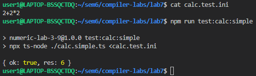
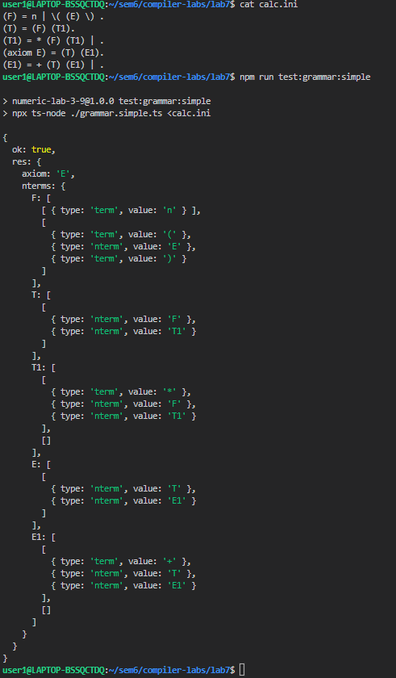
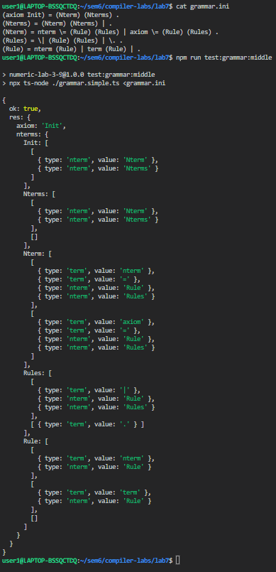
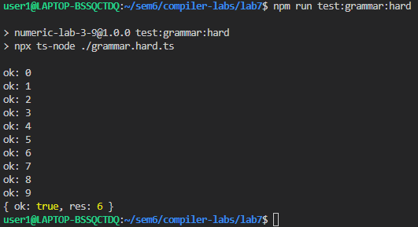

| Вариант 3 ([7.1](https://github.com/bmstu-iu9/compiler-labs/blob/88ac9ea7f1dbbbc911b5fbade99b76facc4ed589/7/lab71.pdf), [7.2](https://github.com/bmstu-iu9/compiler-labs/blob/88ac9ea7f1dbbbc911b5fbade99b76facc4ed589/7/lab72.pdf)) |
| -- |
|  |
|  |
|  |
|  |
